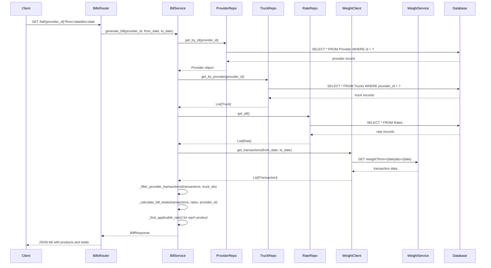
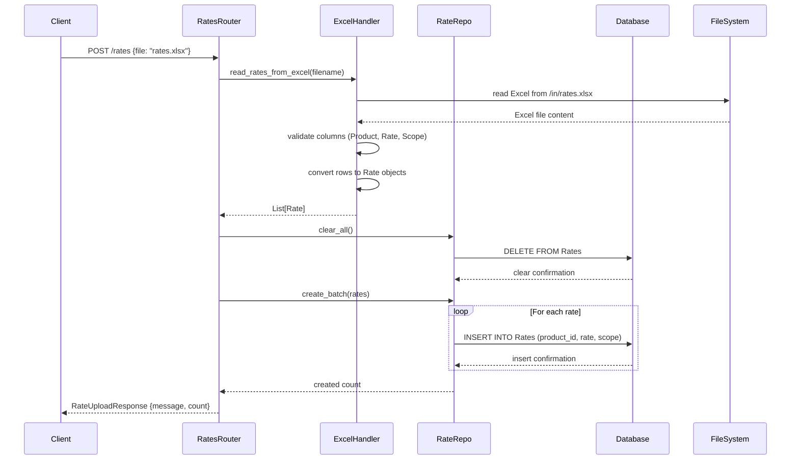
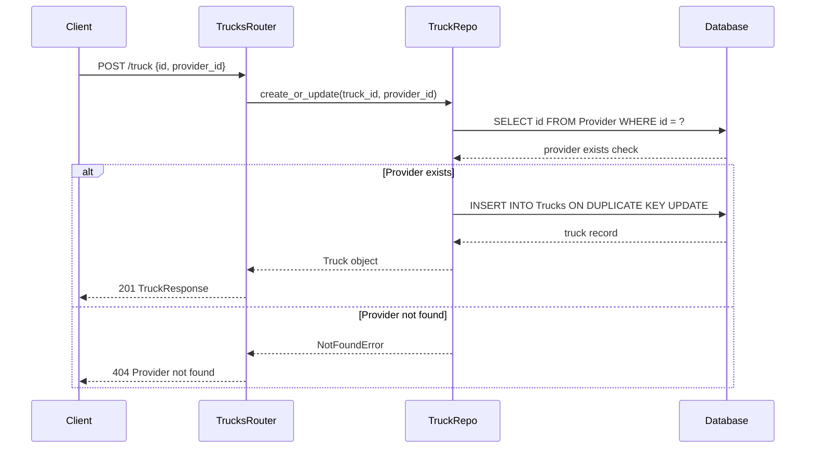
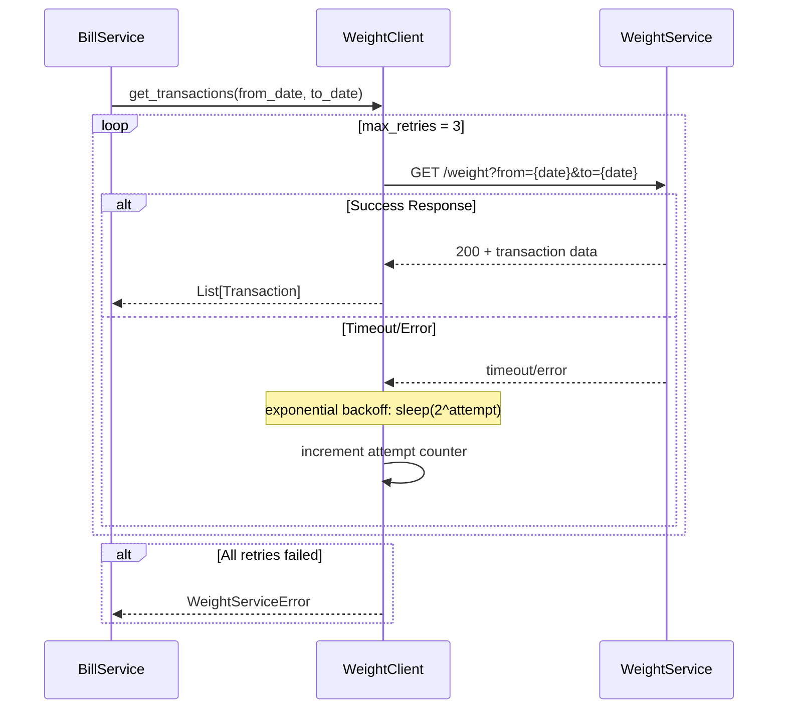
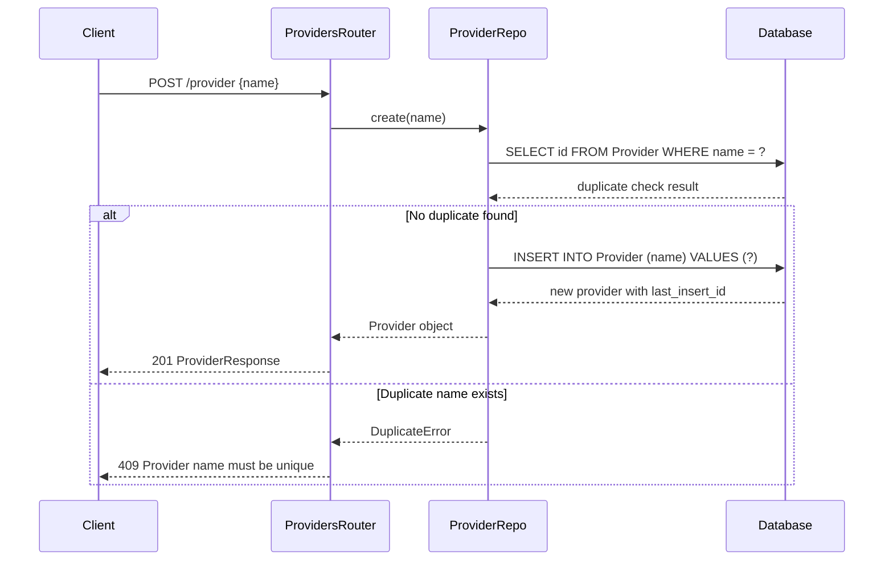
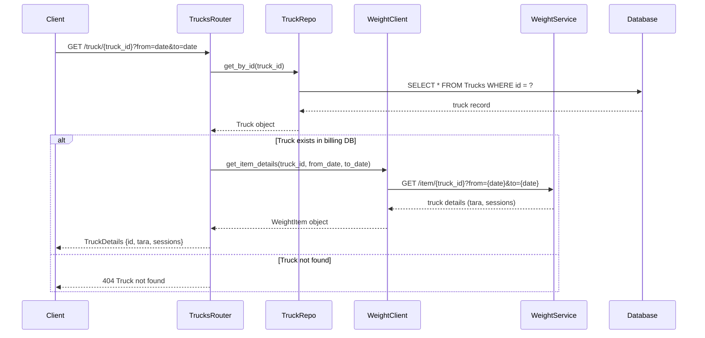
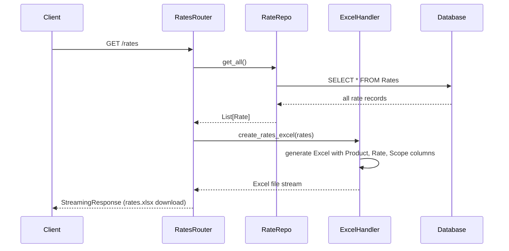

# Billing Service Sequence Diagrams

This document contains mermaid sequence diagrams showing the software flows within the Billing Service.

## 1. Bill Generation Flow (Main Business Logic)

## 2. Rate Management Flow

## 3. Truck Registration Flow

## 4. Weight Service Integration with Retry Logic

## 5. Provider Management Flow

## 6. Truck Details Retrieval Flow

## 7. Rate Download Flow

## Architecture Summary

The billing service follows a clean architecture with these key components:

- **API Layer**: FastAPI routers handling HTTP requests
- **Service Layer**: Business logic and orchestration
- **Repository Layer**: Data access abstraction
- **External Integration**: Weight service client with retry logic
- **Error Handling**: Comprehensive exception handling with proper HTTP status codes

### Key Design Patterns

1. **Repository Pattern**: Clean separation of data access logic
2. **Service Layer Pattern**: Business logic encapsulation
3. **Retry Pattern**: Resilient external service integration
4. **Exception Handling Pattern**: Consistent error responses

### Business Logic Highlights

- **Rate Precedence**: Provider-specific rates override general rates
- **Bill Calculation**: Neto weight × rate = payment amount
- **Transaction Filtering**: Only processes transactions for provider's trucks
- **Excel Processing**: Batch upload/download of pricing rates