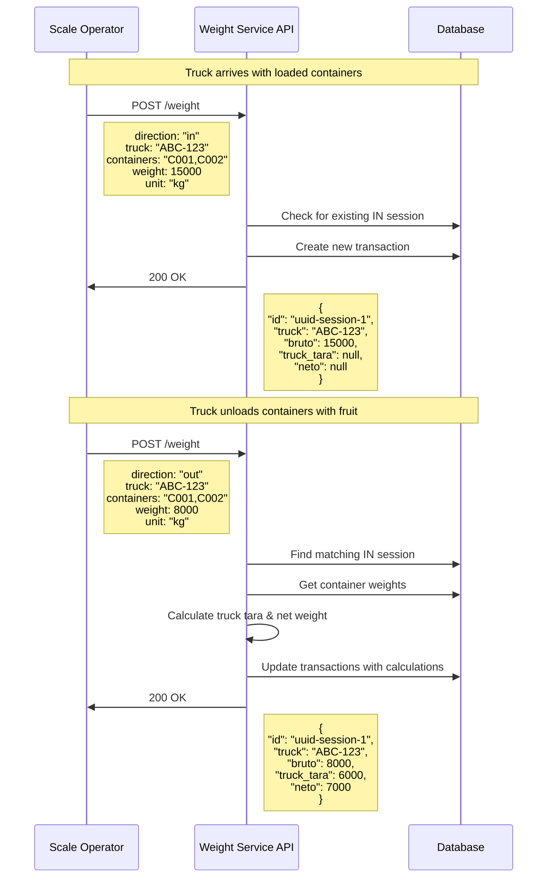
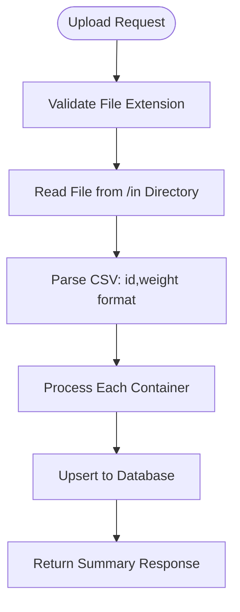
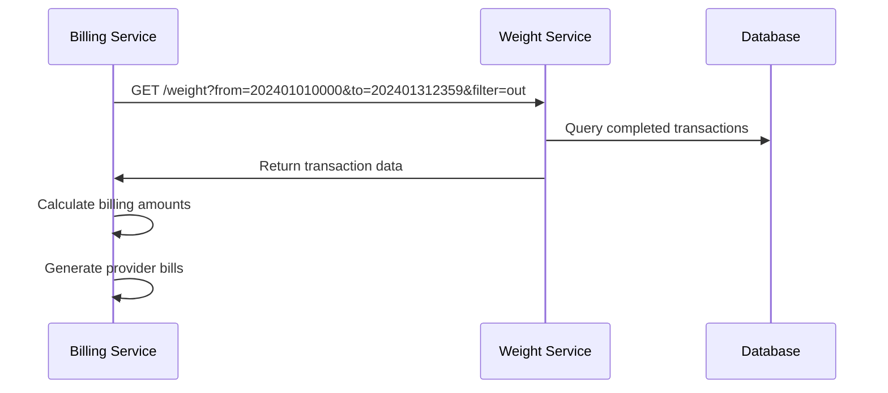

# Weight Service  - API Workflows & Documentation

This document provides detailed workflow documentation for all API endpoints in the Weight Service V2, including business scenarios, integration patterns, and best practices.

## Table of Contents
- [Overview](#overview)
- [Weight Recording Workflows](#weight-recording-workflows)
- [Batch Operations](#batch-operations)
- [Query Operations](#query-operations)
- [Integration Patterns](#integration-patterns)
- [Error Handling](#error-handling)
- [Best Practices](#best-practices)

## Overview

The Weight Service  provides RESTful APIs for industrial truck weighing operations. The service follows a session-based approach where IN and OUT weighings are linked through session IDs to calculate net fruit weights.

### Core Business Formula
```
Bruto (Gross Weight) = Neto (Net Fruit) + Truck Tara + Σ(Container Tara)
```

## Weight Recording Workflows

### 1. Standard IN/OUT Weighing Sequence

#### Workflow: Complete Truck Weighing Process


#### Example API Calls

**Step 1: Record IN weighing**
```bash
curl -X POST http://localhost:5001/weight \
  -H "Content-Type: application/json" \
  -d '{
    "direction": "in",
    "truck": "ABC-123",
    "containers": "C001,C002,C003",
    "weight": 15000,
    "unit": "kg",
    "produce": "orange"
  }'
```

**Response:**
```json
{
  "id": "550e8400-e29b-41d4-a716-446655440000",
  "truck": "ABC-123",
  "bruto": 15000,
  "truck_tara": null,
  "neto": null
}
```

**Step 2: Record OUT weighing**
```bash
curl -X POST http://localhost:5001/weight \
  -H "Content-Type: application/json" \
  -d '{
    "direction": "out",
    "truck": "ABC-123",
    "containers": "C001,C002,C003",
    "weight": 8000,
    "unit": "kg",
    "produce": "orange"
  }'
```

**Response:**
```json
{
  "id": "550e8400-e29b-41d4-a716-446655440000",
  "truck": "ABC-123",
  "bruto": 8000,
  "truck_tara": 6000,
  "neto": 7000
}
```

### 2. Standalone Weighing (NONE Direction)

Used for container-only weighing or calibration purposes.

```bash
curl -X POST http://localhost:5001/weight \
  -H "Content-Type: application/json" \
  -d '{
    "direction": "none",
    "truck": "na",
    "containers": "C001",
    "weight": 500,
    "unit": "kg"
  }'
```

### 3. Force Mode Operations

When normal business rules need to be bypassed:

```bash
curl -X POST http://localhost:5001/weight \
  -H "Content-Type: application/json" \
  -d '{
    "direction": "out",
    "truck": "XYZ-789",
    "containers": "C004,C005",
    "weight": 3000,
    "unit": "kg",
    "force": true
  }'
```

## Batch Operations

### Container Weight Upload Workflows

#### CSV Format Upload


**CSV File Format Example (`containers.csv`):**
```csv
C001,450
C002,520
C003,480
C004,600
```

**API Call:**
```bash
curl -X POST http://localhost:5001/batch-weight \
  -H "Content-Type: application/json" \
  -d '{
    "file": "containers.csv"
  }'
```

#### JSON Format Upload

**JSON File Format Example (`containers.json`):**
```json
[
  {"id": "C001", "weight": 450, "unit": "kg"},
  {"id": "C002", "weight": 1146, "unit": "lbs"},
  {"id": "C003", "weight": 480, "unit": "kg"}
]
```

**Response:**
```json
{
  "message": "Batch upload completed successfully",
  "processed_count": 150,
  "skipped_count": 5,
  "errors": []
}
```

## Query Operations

### 1. Transaction History Queries

#### Get Transactions by Date Range
```bash
curl "http://localhost:5001/weight?from=20240101000000&to=20240131235959&filter=in,out"
```

**Response:**
```json
[
  {
    "id": "550e8400-e29b-41d4-a716-446655440000",
    "direction": "in",
    "truck": "ABC-123",
    "bruto": 15000,
    "neto": "na",
    "produce": "orange",
    "containers": ["C001", "C002", "C003"]
  },
  {
    "id": "550e8400-e29b-41d4-a716-446655440000",
    "direction": "out",
    "truck": "ABC-123", 
    "bruto": 8000,
    "neto": 7000,
    "produce": "orange",
    "containers": ["C001", "C002", "C003"]
  }
]
```

### 2. Item Details Queries

#### Get Truck Information
```bash
curl "http://localhost:5001/item/ABC-123?from=20240101000000&to=20240131235959"
```

**Response:**
```json
{
  "id": "ABC-123",
  "tara": 6000,
  "sessions": [
    "550e8400-e29b-41d4-a716-446655440000",
    "660f9511-f30c-52e5-b827-557766551111"
  ]
}
```

#### Get Container Information
```bash
curl "http://localhost:5001/item/C001"
```

**Response:**
```json
{
  "id": "C001",
  "tara": 450,
  "sessions": [
    "550e8400-e29b-41d4-a716-446655440000"
  ]
}
```

### 3. Session Details

```bash
curl "http://localhost:5001/session/550e8400-e29b-41d4-a716-446655440000"
```

**Response:**
```json
{
  "id": "550e8400-e29b-41d4-a716-446655440000",
  "truck": "ABC-123",
  "bruto": 15000,
  "truck_tara": 6000,
  "neto": 7000
}
```

### 4. Unknown Containers

```bash
curl "http://localhost:5001/unknown"
```

**Response:**
```json
["C010", "C011", "C012"]
```

## Integration Patterns

### 1. Billing Service Integration

The Billing Service can query transaction data for bill generation:



### 2. Real-time Monitoring

External monitoring systems can track service health:

```bash
# Health check
curl "http://localhost:5001/health"

# Response
{
  "status": "OK",
  "database": "connected", 
  "timestamp": "2024-01-15T10:30:00Z"
}
```

### 3. Data Export Workflows

For reporting and analytics:

```bash
# Export all transactions for a month
curl "http://localhost:5001/weight?from=20240101000000&to=20240131235959" > monthly_report.json

# Export specific truck data
curl "http://localhost:5001/item/ABC-123?from=20240101000000&to=20240131235959" > truck_report.json
```

## Error Handling

### Common Error Scenarios

#### 1. Invalid Weighing Sequence
```bash
# Try to do OUT without IN
curl -X POST http://localhost:5001/weight \
  -d '{"direction": "out", "truck": "NEW-123", "containers": "C001", "weight": 5000}'
```

**Error Response (400):**
```json
{
  "detail": "Invalid weighing sequence: No matching IN transaction found for truck=NEW-123, containers=[C001]"
}
```

#### 2. Unknown Container Weights
```bash
# Try OUT with unregistered containers
curl -X POST http://localhost:5001/weight \
  -d '{"direction": "out", "truck": "ABC-123", "containers": "UNKNOWN", "weight": 5000}'
```

**Error Response (400):**
```json
{
  "detail": "Container not found: Unknown container weights for calculation: UNKNOWN"
}
```

#### 3. Invalid Input Data
```bash
# Invalid weight value
curl -X POST http://localhost:5001/weight \
  -d '{"direction": "in", "truck": "ABC-123", "containers": "C001", "weight": -1000}'
```

**Error Response (422):**
```json
{
  "detail": [
    {
      "type": "greater_than",
      "loc": ["body", "weight"],
      "msg": "Input should be greater than 0",
      "input": -1000
    }
  ]
}
```

### Error Recovery Patterns

#### Retry Logic for Transient Errors
```python
import requests
import time

def record_weight_with_retry(data, max_retries=3):
    for attempt in range(max_retries):
        try:
            response = requests.post("http://localhost:5001/weight", json=data)
            if response.status_code == 200:
                return response.json()
            elif response.status_code >= 500:
                # Server error - retry
                time.sleep(2 ** attempt)  # Exponential backoff
                continue
            else:
                # Client error - don't retry
                return response.json()
        except requests.RequestException:
            time.sleep(2 ** attempt)
    
    raise Exception("Max retries exceeded")
```

## Best Practices

### 1. API Usage Guidelines

#### Always Check Health Before Operations
```bash
curl "http://localhost:5001/health"
```

#### Use Proper Error Handling
```python
try:
    response = requests.post("/weight", json=weight_data)
    response.raise_for_status()
    result = response.json()
except requests.HTTPError as e:
    if e.response.status_code == 400:
        # Handle business logic errors
        handle_business_error(e.response.json())
    else:
        # Handle other HTTP errors
        handle_http_error(e)
except requests.RequestException as e:
    # Handle network/connection errors
    handle_network_error(e)
```

#### Validate Input Data Client-Side
```python
def validate_weight_request(data):
    required_fields = ["direction", "containers", "weight"]
    for field in required_fields:
        if field not in data:
            raise ValueError(f"Missing required field: {field}")
    
    if data["weight"] <= 0:
        raise ValueError("Weight must be positive")
    
    if data["direction"] not in ["in", "out", "none"]:
        raise ValueError("Invalid direction")
```

### 2. Performance Optimization

#### Batch Container Updates
Instead of individual container registrations, use batch uploads:
```bash
# Efficient - batch upload
curl -X POST http://localhost:5001/batch-weight -d '{"file": "containers.csv"}'

# Inefficient - individual calls
for container in containers:
    curl -X POST http://localhost:5001/weight -d '{...}'
```

#### Use Date Range Filters
```bash
# Good - specific date range
curl "http://localhost:5001/weight?from=20240101000000&to=20240107235959"

# Avoid - no date limits (returns too much data)
curl "http://localhost:5001/weight"
```

### 3. Integration Patterns

#### Asynchronous Processing
```python
import asyncio
import aiohttp

async def process_multiple_weighings(weighing_data_list):
    async with aiohttp.ClientSession() as session:
        tasks = []
        for data in weighing_data_list:
            task = record_weighing_async(session, data)
            tasks.append(task)
        
        results = await asyncio.gather(*tasks, return_exceptions=True)
        return results

async def record_weighing_async(session, data):
    async with session.post("http://localhost:5001/weight", json=data) as response:
        return await response.json()
```

#### Event-Driven Architecture
```python
def on_weighing_complete(session_id, truck, neto):
    """Handle completed weighing event"""
    if neto and neto != "na":
        # Notify billing service
        notify_billing_service(session_id, truck, neto)
        
        # Update inventory system
        update_inventory(truck, neto)
        
        # Log for analytics
        log_transaction_analytics(session_id, truck, neto)
```

### 4. Monitoring and Observability

#### Health Check Monitoring
```bash
#!/bin/bash
# health_check.sh
while true; do
    if curl -f "http://localhost:5001/health" > /dev/null 2>&1; then
        echo "$(date): Service healthy"
    else
        echo "$(date): Service unhealthy" >&2
        # Alert mechanism here
    fi
    sleep 30
done
```

#### Transaction Monitoring
```python
def monitor_transaction_rates():
    """Monitor transaction processing rates"""
    start_time = datetime.now() - timedelta(hours=1)
    end_time = datetime.now()
    
    response = requests.get(f"/weight", params={
        "from": start_time.strftime("%Y%m%d%H%M%S"),
        "to": end_time.strftime("%Y%m%d%H%M%S")
    })
    
    transactions = response.json()
    rate = len(transactions) / 60  # transactions per minute
    
    if rate < expected_minimum_rate:
        alert_low_transaction_rate(rate)
```

---

This documentation provides comprehensive guidance for integrating with and using the Weight Service  APIs effectively.