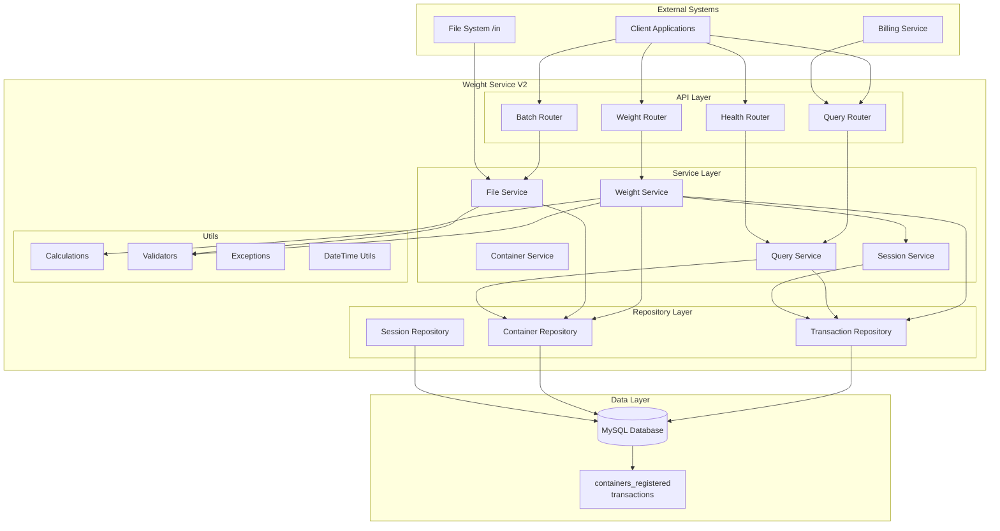
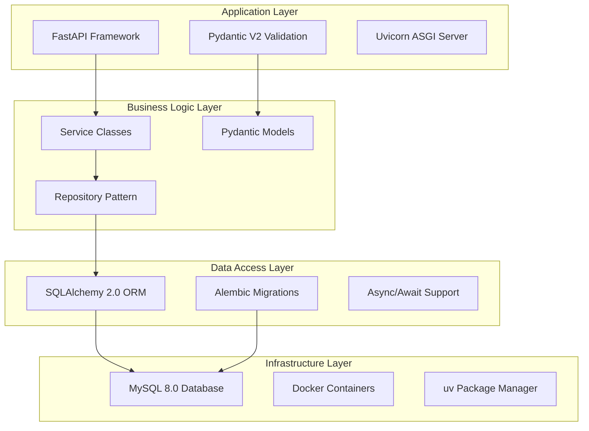
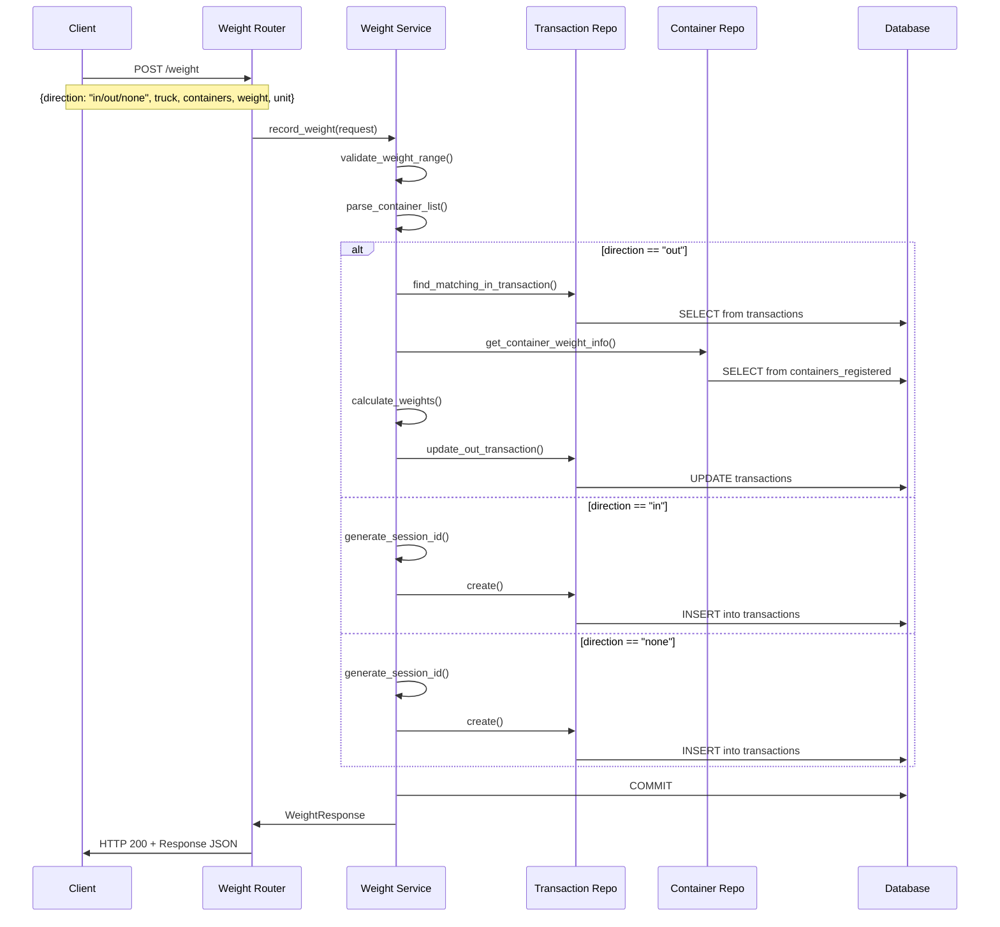
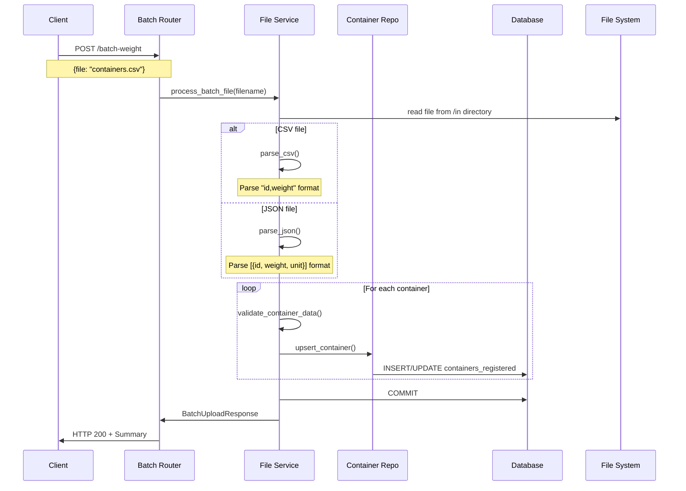
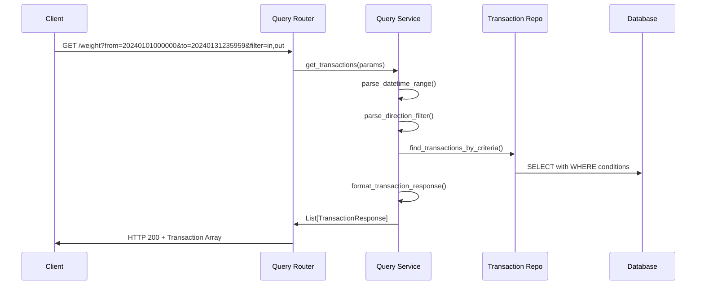
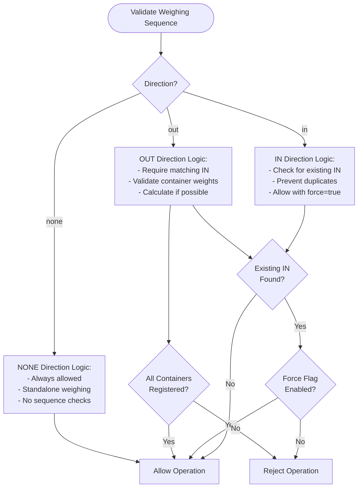
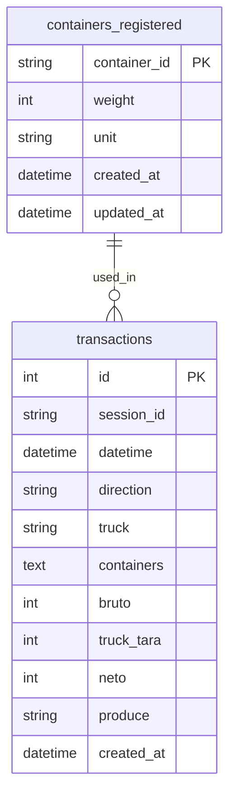
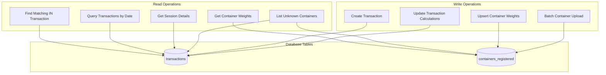
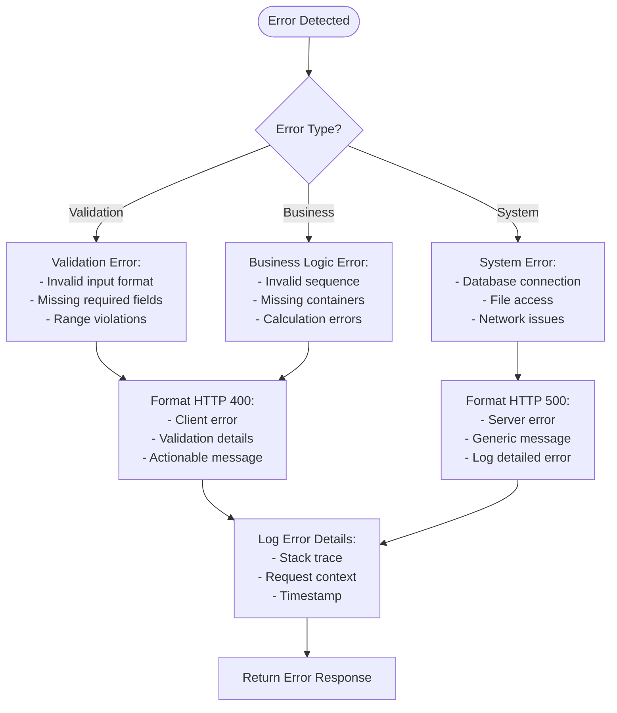
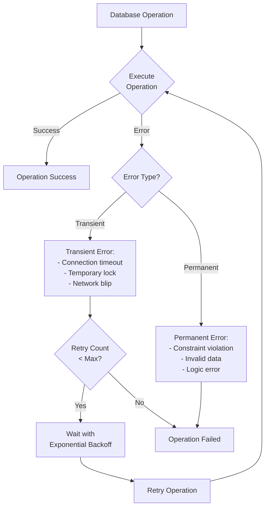

# Weight Service  - Architecture & Flow Diagrams

This document provides comprehensive diagrams for understanding the Weight Service  architecture, API flows, and business logic using Mermaid diagrams.

## Table of Contents
- [System Architecture](#system-architecture)
- [API Flow Diagrams](#api-flow-diagrams)
- [Data Flow Diagrams](#data-flow-diagrams)
- [Business Logic Flows](#business-logic-flows)
- [Database Schema Relationships](#database-schema-relationships)
- [Error Handling Flows](#error-handling-flows)

## System Architecture

### Service Architecture Overview


### Technology Stack Layers


## API Flow Diagrams

### Weight Recording Flow (POST /weight)


### Batch Upload Flow (POST /batch-weight)


### Query Flow (GET /weight)


## Data Flow Diagrams

### Weight Calculation Data Flow
```mermaid
flowchart TD
    START([Weight Recording Request])
    
    INPUT[Input Data:<br/>- Direction<br/>- Truck ID<br/>- Containers<br/>- Weight<br/>- Unit]
    
    PARSE[Parse & Validate:<br/>- Container IDs<br/>- Weight Range<br/>- Unit Conversion]
    
    DIRECTION{Direction Type?}
    
    IN_FLOW[IN Direction Flow:<br/>1. Generate Session ID<br/>2. Store Gross Weight<br/>3. No Calculations]
    
    OUT_FLOW[OUT Direction Flow:<br/>1. Find Matching IN<br/>2. Get Container Weights<br/>3. Calculate Net Weight]
    
    NONE_FLOW[NONE Direction Flow:<br/>1. Generate Session ID<br/>2. Store Weight<br/>3. No Calculations]
    
    CALC[Weight Calculations:<br/>Truck Tara = Bruto(IN) - Bruto(OUT) - Σ(Container Tara)<br/>Net Weight = Bruto(IN) - Truck Tara - Σ(Container Tara)]
    
    STORE[Store Results:<br/>- Update IN transaction<br/>- Create OUT transaction<br/>- Commit to Database]
    
    RESPONSE[Return Response:<br/>- Session ID<br/>- Weight Values<br/>- Calculated Results]
    
    START --> INPUT
    INPUT --> PARSE
    PARSE --> DIRECTION
    
    DIRECTION -->|in| IN_FLOW
    DIRECTION -->|out| OUT_FLOW
    DIRECTION -->|none| NONE_FLOW
    
    OUT_FLOW --> CALC
    CALC --> STORE
    
    IN_FLOW --> STORE
    NONE_FLOW --> STORE
    
    STORE --> RESPONSE
```

### Container Weight Management Flow
```mermaid
flowchart TD
    BATCH_START([Batch Upload Start])
    
    FILE_READ[Read File:<br/>- CSV: id,weight<br/>- JSON: [{id,weight,unit}]]
    
    PARSE{File Format?}
    
    CSV_PARSE[Parse CSV:<br/>- Split by lines<br/>- Extract id,weight pairs<br/>- Default unit: kg]
    
    JSON_PARSE[Parse JSON:<br/>- Deserialize array<br/>- Extract objects<br/>- Support unit field]
    
    VALIDATE[Validate Each Record:<br/>- Container ID format<br/>- Weight > 0<br/>- Unit conversion]
    
    UPSERT[Upsert Container:<br/>- INSERT if new<br/>- UPDATE if exists<br/>- Track processed count]
    
    BATCH_RESULT[Return Results:<br/>- Processed count<br/>- Skipped count<br/>- Error list]
    
    BATCH_START --> FILE_READ
    FILE_READ --> PARSE
    
    PARSE -->|CSV| CSV_PARSE
    PARSE -->|JSON| JSON_PARSE
    
    CSV_PARSE --> VALIDATE
    JSON_PARSE --> VALIDATE
    
    VALIDATE --> UPSERT
    UPSERT --> BATCH_RESULT
```

## Business Logic Flows

### Weighing Sequence Validation


### Weight Calculation Business Logic
```mermaid
flowchart TD
    CALC_START([Weight Calculation])
    
    INPUT_DATA[Input Data:<br/>- Bruto IN (kg)<br/>- Bruto OUT (kg)<br/>- Container IDs]
    
    GET_CONTAINERS[Get Container Weights:<br/>- Query containers_registered<br/>- Convert units to kg<br/>- Check for unknowns]
    
    UNKNOWN_CHECK{Unknown<br/>Containers?}
    
    CALC_TRUCK[Calculate Truck Tara:<br/>Truck Tara = Bruto(IN) - Bruto(OUT) - Σ(Container Tara)]
    
    CALC_NET[Calculate Net Weight:<br/>Net Weight = Bruto(IN) - Truck Tara - Σ(Container Tara)]
    
    VALIDATE_RESULT[Validate Results:<br/>- Truck Tara ≥ 0<br/>- Net Weight ≥ 0<br/>- Logical consistency]
    
    RETURN_SUCCESS[Return Calculated Values]
    RETURN_ERROR[Return Error: Unknown Containers]
    
    CALC_START --> INPUT_DATA
    INPUT_DATA --> GET_CONTAINERS
    GET_CONTAINERS --> UNKNOWN_CHECK
    
    UNKNOWN_CHECK -->|Yes| RETURN_ERROR
    UNKNOWN_CHECK -->|No| CALC_TRUCK
    
    CALC_TRUCK --> CALC_NET
    CALC_NET --> VALIDATE_RESULT
    VALIDATE_RESULT --> RETURN_SUCCESS
```

## Database Schema Relationships

### Entity Relationship Diagram


### Data Access Patterns


## Error Handling Flows

### Error Classification and Handling


### Retry and Recovery Patterns


---

**Note**: These diagrams provide a comprehensive overview of the Weight Service  architecture and flows. They can be rendered using any Mermaid-compatible viewer or integrated into documentation systems that support Mermaid syntax.